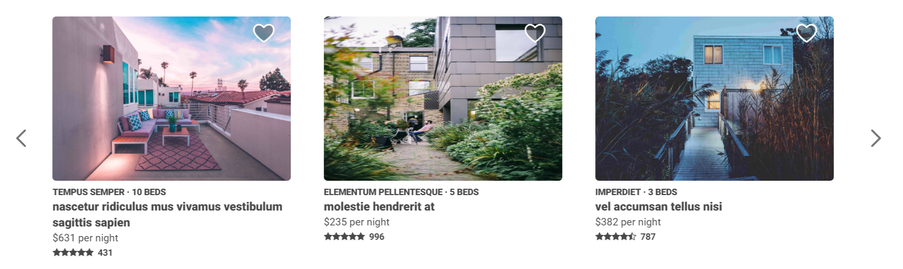
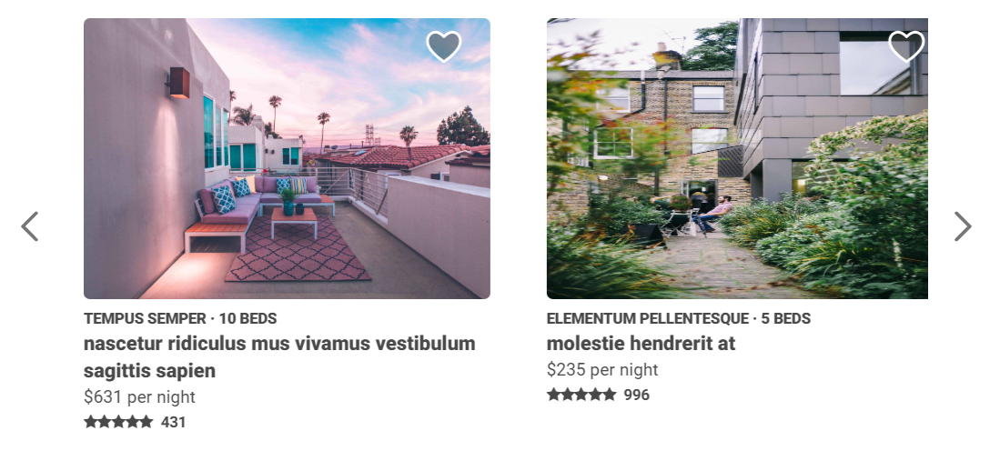
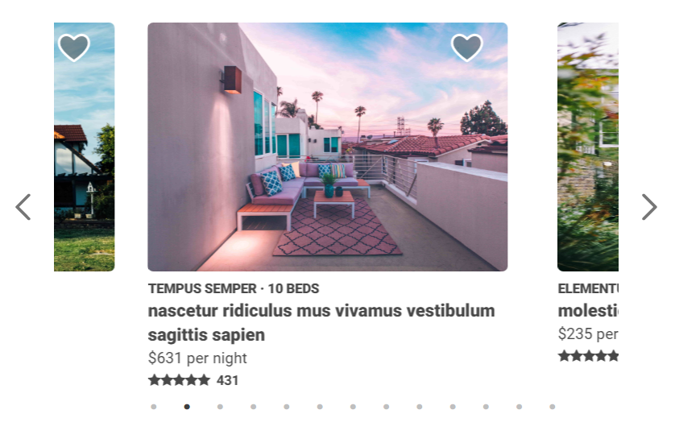

# FlairBnB Similar Listings Component

> A custom-built, responsive clone of the similar listings image carousel component from an AirBnB listing page served as a microservice.

[Link to Deployed Service](http://3.13.91.149/14/)

## Context

For this project, I designed and developed a microservice and front-end clone of an AirBnB Listing Page's *Similar Sistings image carousel component*. The goal of this application was to develop a React clone of a widely used and stateful component, and to explore various front-end performance benchmarking and optimization techniques.

In order to deploy more efficiently and frequently, I developed two dockerized services - one for the service application itself, and one to seed the database with mock data - and coordinated them with a mongoDB image using Docker-Compose. Below are instructions for getting the application running both locally and deployed.


## Getting Started

These instructions will get you a copy of the project up and running on your local machine for development and testing purposes.

*Before seeding the MongoDB instance with mock data, make sure to replace the `dbURL` in db/index.js from `mongo` to `localhost` if running the service locally*

```js
// from root directory
  npm i  // install npm dependencies
  node ./db/insertAllListings.js  // seed MongoDB with mock data
  npm run build  // build bundle with webpack
  npm start  // start the server - listens on localhost:3003
```

## Deploying (AWS EC2 Instance)

- Create a new Ubuntu 18.04 EC2 micro instance on AWS
- ssh into the instance
- [Install Docker](https://www.digitalocean.com/community/tutorials/how-to-install-and-use-docker-on-ubuntu-18-04)
- [Install Docker-Compose (Only Step 1)](https://www.digitalocean.com/community/tutorials/how-to-install-docker-compose-on-ubuntu-18-04)
- Create a new `app` directory and `cd` inside
- Create a new `docker-compose.yml` file and paste the following code inside
```yml
version: '3'
services:
  app:
    container_name: node-service
    restart: always
    image: qwaded13/fec-service
    ports:
      - '80:3003'
    depends_on:
      - mongo
    links:
      - mongo
  mongo:
    container_name: mongo
    image: mongo
    restart: always
    ports:
      - '27017:27017'
  mongo-seeder:
    container_name: mongo-seeder
    image: qwaded13/mongo-seeder
    depends_on:
      - mongo
    links: 
      - mongo
```
- In the terminal, run `docker-compose up -d` to deploy the application
- Navigate to the URL, making sure to include a numerical endpoint
  - example.site.com/13


## Built With

* [SlickJS](https://www.npmjs.com/package/react-slick)
* ReactJS
* NodeJS/Express
* MongoDB
* Docker

## Authors

* [Kevin Kim](https://github.com/qwaded13)

## Examples







## API Sample Response:
```js
{
  "_id": "5c1bf1b999fcfafde67db405",
  "listingName": "curae duis faucibus accumsan odio curabitur",
  "beds": 8,
  "listingId": 2,
  "numberOfReviews": 776,
  "price": 813,
  "propertyType": "in",
  "rating": 1.8,
  "imageUrl": "link/to/jpg"
}
```